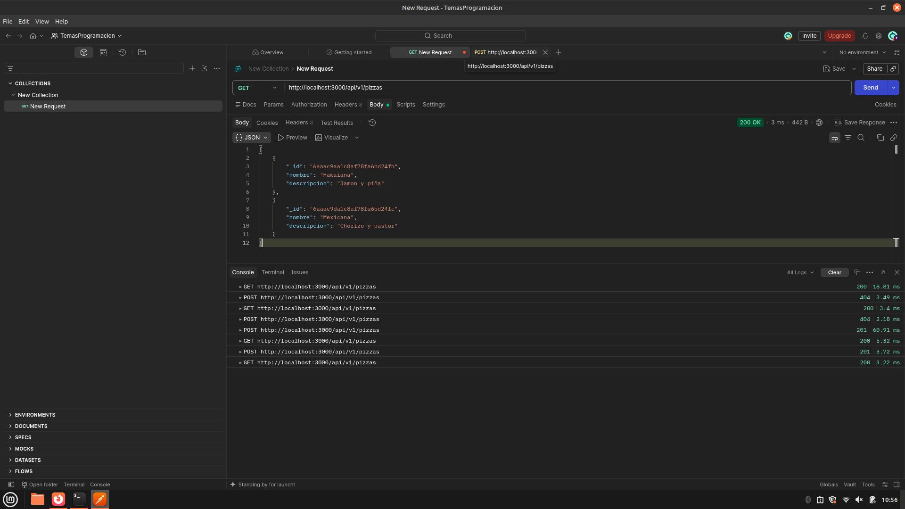

k# CRUD de Pizzas - API con Node.js y MongoDB

**Desarrollado por:** Alan Alejandro Arrieta Flores

## Descripción del Proyecto
Este proyecto es una API RESTful construida con Node.js y Express para gestionar un inventario de pizzas. El código original en memoria fue refactorizado y dockerizado para incluir persistencia de datos real, estructurando una arquitectura con una capa de servicios y repositorios.

## Tema de la Base de Datos
**MongoDB (NoSQL)**
Para la persistencia de datos se utilizó **MongoDB**. En lugar de usar herramientas de modelado estructuradas, la conexión se realiza directamente a través del driver oficial nativo (`mongodb`), interactuando con los documentos y colecciones mediante los métodos asíncronos del driver (`insertOne`, `find`, `findOne`, `updateOne`, `deleteOne`).

## Requisitos Previos
Para ejecutar este proyecto, asegúrate de tener instalado en tu entorno (Linux):
- [Node.js](https://nodejs.org/) y npm.
- [Docker](https://www.docker.com/) (para levantar el contenedor de la base de datos).
- [Postman](https://www.postman.com/) (para realizar las pruebas).

## Instrucciones para Ejecutarlo

1. **Clonar el repositorio:**
   ```bash
   git clone [https://github.com/AlanArrietaF/CrudMongo.git](https://github.com/AlanArrietaF/CrudMongo.git)
   cd CrudMongo
   ```

2. **Instalar dependencias:**
    ```bash
    npm install
    ```
3. **Levantar la base de datos:**
Inicia el contenedor de MongoDB en segundo plano usando Docker exponiendo el puerto 27017:
    ```bash 
    sudo docker run -d --name mi-mongo -p 27017:27017 mongo
    ```
4. **Iniicar el servidor local:**
    ```bash
    node index.js
    ```

5. **Prebas con Postman:**


